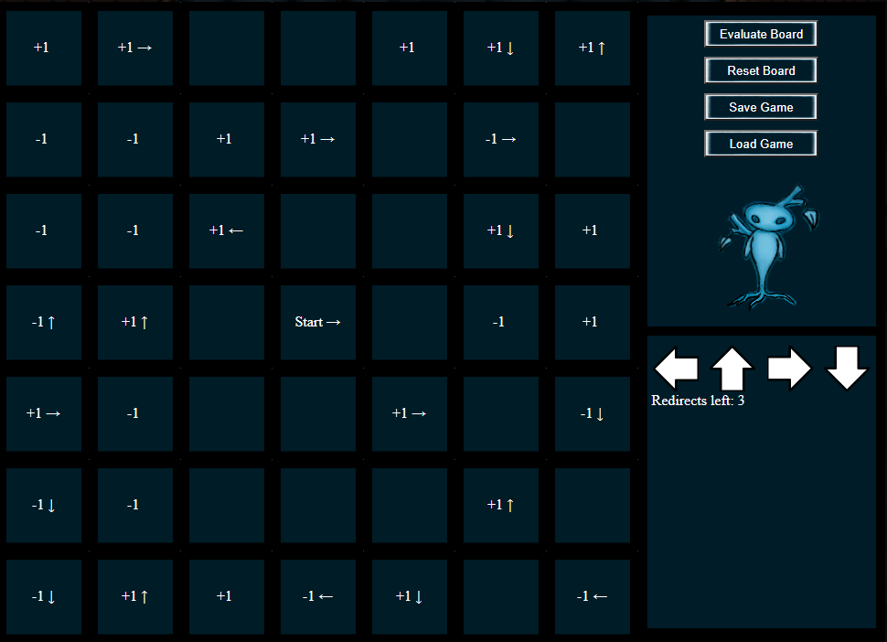
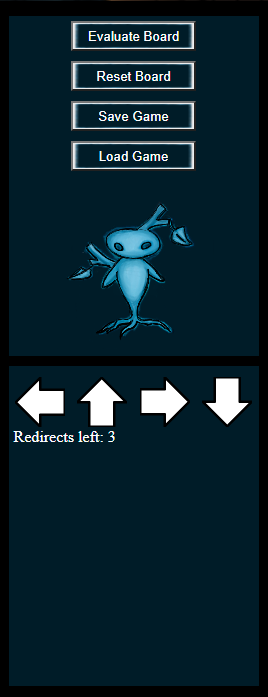
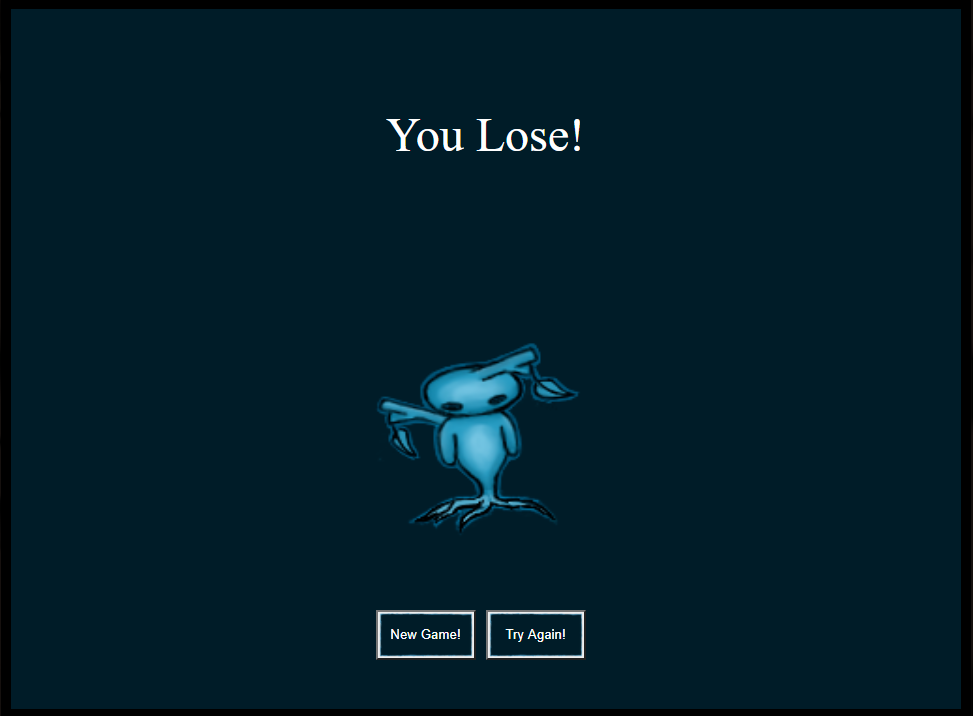

Sprit's Forest
=====================================

Live App:

https://sprits-forest.vercel.app

Summary
----------------------------
This app is a small grid-base puzzle game in which the user
attempts to neutralize the corruption spreading into the forest.
Users make an account to store/load save games and to track how
many times they've completed a puzzle.

Example Board:

The left side shows the gameboard. 

Corruption begins at the start square and travels following the arrows. 

Arrows are ignored after they're passed the first time (no infinite loops). 

Corruption increases or decreases as it passes +1's and -1's. 

Corruption starts at 3 and the goal is to have it at 0 or less by the time it reaches any edge of the board.

Controls: 

Players have a limited amount of redirects that can be used via clicking the arrows and placing them on the board. These change the direction the corruption will travel and can overwrite anything but the starting square. 

Players also have the option to reset the board, save a board state, load their stored board state, and submit their solution.

Technology
-----------------------------
The front-end client uses React and JavaScript. React powers the page layouts and functionality. It also powers the game engine via state. Vanilla CSS is used for styling.

The back-end api uses JavaScript, Node, Express, and PostgresSQL.

API
------------------------------
The API has two goals: retrieve level information and access/alter user information

### Level API:

There is no case currently where we want the user to modify level information. Perhaps in future, a level editor could be implemented, and a post added. For now, the primary concern is loading levels. 

'/api/levels' (GET) - requires jwt token: Retrieves all levels in the database

'/api/levels/random' (GET) - requires jwt token: Retrieves a random level in the database

### User API:

Users need to be able to create, modify, and delete their accounts. The front end needs to retrieve this info. So the full CRUD operations
have been implemented.

'/api/users'

(GET) - Requires jwt token: Retrieves relevant user information such as savegame and score. It does not return the user's password.

(PATCH) - Requires jwt token: Updates user information based on body sent. Username and password are validated as discussed in POST. Returns updated jwt token. 
Available parameters are: username - string, password - string, score - number, savegame - string.

(DELETE) - Requires jwt token: Deletes the user from the database.

(POST) - Creates a new user based on body sent. There can be no duplicate usernames. Passwords must be at least 8 characters long and contain at least 1 uppercase letter, 1 number, and 1 special character. Returns jwt token.

### Login API:

Users need a way to protect their account. The login service does this via jwt tokens. Most API fetches will fail without a valid token.

'/api/login'
(POST) - Validates user information and returns a jwt token.